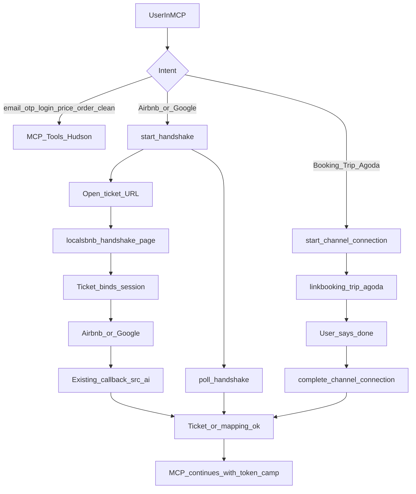

# 海外 LocalsBnb AI：无 PC 闭环与运营能力方案

> 状态（2026-10-09）：P0/P1/S08/S09 MCP 实现在工作区、尚未提交；PC HTTPS 修复已提交为 `4d0fd73`，用户确认 dev 发布。**S05/S06 开链通过；S08/S09 人工验收通过**（S08 暂无真实渠道账号；S09 含真实写入与脏净房）。**AI 唤起页移动端 + 六语已在海外 PC/MCP 落地**（DevTools 375 通过；真机与 overseas-dev 发布待补，见交接第 0.12 节）。S07 暂停；S10 Airbnb 真连暂缓。见 [给 Xcode 的交接](./ai-onboarding-xcode-handoff.zh-CN.md)。  
> 产品形态（已确认）：一期继续以 **MCP** 为主（Claude / ChatGPT / Cursor），不做自建 AI 对话产品。  
> 参考实现：海外 PC `/Users/lijitao/loclas/overseas/localsbnb`

---

> 开发决定：用户同意因缺少真实 Airbnb 账号暂缓 OAuth / poll / 导入验收，现有验证结果可支持继续开发。HTTPS 修复的 13 项测试与完整 dev 构建通过，随后提交发布并于 2026-10-08 完成 S05 在线复测，见交接文档第 0.7 节。暂缓不等于真实授权已通过。

**S05、S06 开链验证已完成；S08/S09 人工验收已通过（2026-10-09）；AI 唤起页移动端代码已落地。** API 环境修复已在线生效，`/camps/get` 的 `COMMON_PERMISSION_DENIED` 仍为独立待办（见交接第 0.9 节）。S07 暂停；S08 **暂无真实渠道账号**做完整真连；S09 含真实写入与回查；开链页须支持手机浏览器（六语）；S10 Airbnb 真连暂缓。MCP 与海外 PC 移动端改动尚未全部提交/发布。步骤状态以[交接文档执行进度](./ai-onboarding-xcode-handoff.zh-CN.md#execution-progress)为准。

> 阅读口径：本文保留方案目标和此前联调记录；第 2 节是改造前基线，第 3、5 节含尚未全部实现的设计。当前事实以交接文档第 0 节为准：无凭证仅 4 个 auth 工具；回调由浏览器调用 Hudson 换码接口；PC ticket 仅 pending/opened，MCP poll 比较账号变化；共享存储、一次性消费、完成状态关联仍待补齐。本文原有「已发布」表述不代表本次部署验收通过。

## 1. 背景与目标

### 1.1 当前问题

海外 LocalsBnb AI（npm 包 `localsbnb-mcp-server`）是宿主里的工具层，没有独立聊天 UI。启动必须已有：

- `APP_SECRET`：Hudson token（PC/APP 登录后复制）
- `APP_ID`：门店 `campId`

新用户拿不到凭证就无法使用 MCP。Airbnb 直连必须跳转到 Airbnb 官网登录并授权，无法在 LLM 对话框内完成。因此历史上只能先走路客云 / LocalsBnb PC 或 APP。

### 1.2 目标

1. 新用户可以直接使用 LocalsBnb AI，完成账号全流程，不必先使用 PC 或 APP。
2. 对话能完成的步骤留在对话；必须离开对话的步骤（第三方 OAuth）打开网页，对话框轮询结果，成功后再继续输出。
3. 在 AI 内完成注册、渠道授权关联，并补齐改价、改房态、录单等运营写能力。

### 1.3 非目标（一期）

- 不做 LocalsBnb 自建聊天网页/App 作为主入口。
- 不把全部 PC 后台搬进对话（复杂映射、错店/错人可先留 Handshake 短页）。
- 不向 Airbnb Partner 新登记一套 AI 专用 `redirect_uri`（复用已登记回调）。
- 一期不开放订单取消（与现有海外写工具规范一致）。

---

## 2. 现状对照

| 环节 | AI（MCP）现状 | 海外 PC 现状 |
|------|----------------|--------------|
| 启动 | 无凭证直接拒绝，见 `src/server.ts` | 未登录可打开注册 |
| 注册 / 登录 | 无工具 | `/user/bnb/sign-up`、`sign-in`、邮箱 OTP、Google |
| camp | 必须预先配置 `APP_ID` | 注册后 `POST /camps/get`；前端不单独调建店 |
| Airbnb | 无 | 直连 `https://www.airbnb.com/oauth2/auth`，`redirect_uri` 写死/环境变量，**不能按请求改** |
| Booking / Trip / Agoda | 无 | 填渠道 Property ID，**不是**渠道网页 OAuth |
| 写操作 | 仅入住 / 退房 / 续住 / 排房，且须 `confirm=true` | 已有改价、开关房、手工录单 |

关键代码：

- MCP 鉴权：`src/auth/apiKeyManager.ts`、`src/server.ts`
- MCP 工具：`src/config/tools.ts`、`src/tools/overseas/writes.ts`
- PC 注册登录：`lib/api/services/user.ts`、`components/Auth/SignUpModal.tsx`
- PC Airbnb：`lib/airbnb/oauth.ts`、`pages/channel/airbnb/callback.tsx`、`components/AirbnbLink/AirbnbLinkFlow.tsx`

### 2.1 真正卡点：会话不在同一个地方

对话里注册成功后，token 只存在 MCP 进程（以及将来的本地凭证文件），**浏览器没有 `localsbnb_auth_token` cookie**。

若直接打开现有 `/linkairbnb`：

- PC 会当成未登录；
- `/channel/airbnb/callback` 当前要求 `isAuthenticated`。

因此不能只发一个普通官网链接。必须有 **带票据的 Handshake 页**，让浏览器临时具备同一会话后再跳 Airbnb。

PC 已有 App 回跳：`state` 含 `src=app` + `returnUrl`，回调不在 PC 换码，把 `code` 交回 App。AI 应做成同类的 `src=ai`，但 **换码必须在 Handshake 服务端完成**（OAuth code 只能用一次）。

---

## 3. 原则：对话主路径 + Handshake 旁路

能力分成三类：

1. **纯对话**：邮箱注册/登录、拉取 camp、改价、开关房、录单、Booking 填 Property ID、导入 listing 勾选。
2. **必须网页**：Airbnb OAuth、Google OAuth。
3. **复杂确认（可后置）**：错店/错人转移、房型手工映射。一期可网页，二期再收进对话。

不要把邮箱 OTP、改价、录单做成网页。那会把 AI 做成外挂浏览器，与「No LocalsBnb app」定位冲突。网页只承担：

- 临时会话注入
- 第三方 OAuth
- Booking / Trip / Agoda 直连多步配置（AI 打开浏览器页，用户完成后回对话回复「已完成」）
- 极少数复杂确认

上述网页须在**手机与桌面浏览器**均可用（viewport、主 CTA、无整页横溢；文案六语），见交接第 0.12 节。轮询的是 **ticket / 业务结果**（账号已绑定、import 完成、渠道映射变化），不是去爬第三方页面。



轮询约定（适配 MCP 工具超时）：

- `start_handshake` **立刻**返回 `openUrl` + `ticketId`，不阻塞。
- 模型告知用户打开链接，再反复调用 `poll_handshake`（每次最多等待 5–10 秒）。
- 超时、关闭、失败返回明确状态；用户可再说「我已完成授权」。
- 文档与 tool description 必须写明：pending 就再次 poll；页面同时提示完成后回到对话框发送固定话术。

---

## 4. 新用户主路径

1. 安装 MCP，**可不填** `APP_SECRET` / `APP_ID`（直配方案仍可用，见下）。
2. 「帮我注册 LocalsBnb」→ 对话收集邮箱、姓名、房源数量、手机 → `sign-up/check` → 发邮箱 OTP → 用户把验证码贴回对话 → `/user/bnb/sign-up` 拿到**短期登录 JWT**（请求头加 `Bearer`）→ `POST /camps/get` 得到 `campId` → `/user/secret/get` 或 `/user/secret/generate` 拿到**持久 App Secret**（请求头不加 `Bearer`）→ 写入本地凭证。
3. 「连接 Airbnb」→ `start_handshake`（先尝试唤起系统浏览器一次，失败再给 `openUrl`）→ Handshake 页种 cookie → Airbnb 授权。**完整 OAuth 的目标 Handshake 源为** `https://overseas-dev.localhome.cn`（`LOCALSBNB_SITE_URL`）。页面须手机可用。localhost 只能测开链。
4. 对话列出可导入 listing（`quickOnline/pull`）→ 用户自然语言勾选 → `quickOnline/import`；或用户在浏览器完成导入后回对话「已完成」→ `poll_handshake`。
5. 「连接 Booking / Trip / Agoda」→ `start_channel_connection` 打开对应 `/link*` 页 → 用户在浏览器完成 →「已完成」→ `complete_channel_connection`。
6. 此后改价、关房、开房、录单、脏净房都在对话完成；写操作一律先预览再 `confirm=true`。

已有 PC 用户：**直配方案不变**——环境变量 `APP_SECRET` + `APP_ID` 优先于本地文件；也可在对话里 `sign_in` 覆盖本地凭证。`APP_SECRET` 与 generate 返回值同类，wire 上均不加 `Bearer`。

---

## 5. 三块改造范围

### 5.1 MCP：允许无凭证启动（bootstrap）

改动入口：`src/server.ts`、`src/auth/apiKeyManager.ts`。

- 无凭证时仍启动，当前只暴露 **4 个 auth 工具**；登录并识别为海外店后才暴露 Handshake。
- 登录成功后换持久 App Secret，调用已有 `setHudsonCredentials`，写入本机 `~/.localsbnb/credentials.json`（权限 `0600`），并刷新 tool 列表（已有 `listChanged`）。
- 下次启动：**优先环境变量** `APP_SECRET` + `APP_ID`（直配方案不变）；仅当两者都未配置时再读本地文件。
- `hudson-access-token`：登录 JWT 加 `Bearer`；App Secret / 直配 `APP_SECRET` 裸传（见 `src/auth/hudsonToken.ts`）。

ChatGPT 若走 **远程 MCP**，写不了用户磁盘：token 绑在 MCP 会话 + Handshake ticket。长期应对齐 MCP OAuth。一期文档必须写清：

| 宿主 | 凭证落点 |
|------|----------|
| Cursor / Claude Desktop（stdio） | `~/.localsbnb/credentials.json` |
| ChatGPT 远程 MCP | 会话绑定；或用户把返回的 token 填进连接器 |

建议新增工具（名称可再定）：

| 工具 | 作用 |
|------|------|
| `sign_up_check` | 对齐 `POST /user/bnb/sign-up/check` |
| `send_signup_email_code` | 对齐 `POST /user/bnb/auth-code/email`（`type=1`，可带 nickName / houseNum / 手机） |
| `complete_sign_up` | 对齐 `POST /user/bnb/sign-up`（email + authCode + password） |
| `sign_in` | 对齐 `POST /user/bnb/sign-in`；含 MFA 二次 OTP |
| `persist_session` | 内部：写凭证、拉 `/camps/get` |
| `start_handshake` | `type=airbnb_oauth` 或 `google_oauth` |
| `poll_handshake` | 查询 ticket 状态 |
| `list_channel_accounts` | 授权后账号列表 |
| `import_airbnb_listings` | `quickOnline/pull` + `import` |
| `connect_channel_poi` | Booking / Trip / Agoda：`POST /poi/createChannelPoi` |

Google 登录/注册无法在纯对话完成，一律走 Handshake。

邮箱注册字段对齐 PC（`SignUpModal` + `user.ts`）：

- 校验：`email` 和/或 `mobile` + `areaCode`
- 发码：`email`、`nickName`、`houseNum`（房源数量，可空）、`countryCode`、`mobile`、`areaCode`、`type=1`
- 最终注册 body **仅** `email`、`authCode`、`password`（≥8 且含字母+数字）
- MFA **不在注册**；只在登录，生产域名默认 `enableMfa: 1`

注册后 camp：前端/MCP **都不调用建店接口**。成功后应立刻 `POST /camps/get`。若列表为空，渠道与日历都会失败，需作为错误态返回。

### 5.2 海外 PC：薄 Handshake，不新开产品站

在海外 PC 增加例如 `/ai/handshake/[ticketId]`。

职责：

1. 用 **opaque ticket** 换临时会话（token **不进 URL query**）。
2. Airbnb：注入会话后走现有 `buildAirbnbAuthorizeUrl`，`state` 增加 `src=ai` 与 ticket id。
3. 回调：`src=ai` 时在服务端 `POST /oauth/code-authorize`（`isAutoCreateRoomCategory=0`、`isAutoMappingRoomCategory=0`），写 ticket=`succeeded`，页面只提示返回 AI 对话。
4. `redirect_uri` 继续用已登记地址：
   - dev：`https://overseas-dev.localhome.cn/channel/airbnb/callback`
   - prod：`https://localsbnb.com/channel/airbnb/callback`
5. 白名单从 App 协议（`localsbnb-app` / `exp` / `exps`）扩展到 `src=ai` + 合法 ticket，**不要**把任意 `returnUrl` 当跳转目标。

Ticket 建议落 Hudson（或 PC BFF）：

| 字段 | 说明 |
|------|------|
| TTL | 15–30 分钟 |
| 使用 | 一次性完成 |
| 状态 | `pending` → `opened` → `succeeded` / `failed` / `expired` |
| 轮询鉴权 | MCP 持有 ticket secret，不能只靠猜 ticketId |

Listing 导入尽量回对话。PC 的 `AirbnbQuickOnlineImportModal` 仅作 Handshake 失败或复杂场景兜底。

Airbnb 换码请求体（与 PC 一致）：

```
campId, channelId: "1", channelClientId, code,
isAutoCreateRoomCategory: 0, isAutoMappingRoomCategory: 0
```

错店 / 错人（`accountWrongCampView` / `accountWrongUserView`）一期可在 Handshake 页处理 `changeCamp` / `changeUser`，MCP 只消费最终成功或失败。

### 5.3 运营写工具：复用 PC 已接 Hudson

与入住相同：**先预览，再 `confirm=true`**。金额继续用分。禁止模型在未查询的情况下编造 `roomCategoryProductId` / `roomId`。

| 能力 | Hudson 接口（PC 已有） | MCP 工具建议 | 阶段 |
|------|------------------------|--------------|------|
| 读渠道价 | `POST /bnbRatePrice/channelPrice/get` | 已有 `query_room_prices` | 已有 |
| 改价 | `POST /bnbRatePrice/channelPrice/save` | `update_channel_prices`（房型、日期、金额、`validWeekDays`） | P3 |
| Airbnb 日历价/连住 | `POST /roomCategory/bnb/calendar/update` | 二期，避免与渠道价双写 | P4 |
| 关房 | `POST /bnbRoomStatuses/close` | `close_rooms`（`type`、`roomDates`） | P3 |
| 开房 | `POST /bnbRoomStatuses/open` | `open_rooms` | P3 |
| 保洁 | `POST /room/updateCleanState` | `update_room_clean_state`（脏房/净房/清洁中） | P3 已接 |
| 录单 | `POST /bnbOrder/save`（`orderOpFromType: 1`，手工 `channelId: "0"`） | `create_manual_order`；预览先 `/bnbOrder/calcPayout` | P3 |
| 取消 | `POST /bnbOrder/cancel` | 不做（一期） | 以后 |

PC 参考：

- 改价：`lib/api/services/bnbRatePrice.ts`，日历 `/calendar/price`
- 房态：`lib/api/services/roomStatus.ts`，`ManualBlockDrawer`
- 录单：`lib/api/services/bnbOrder.ts`，`components/Dashboard/NewOrderDrawer`

Booking / Trip / Agoda（P2，一般不需要网页）：

| 渠道 | channelId | 路径 |
|------|-----------|------|
| Booking.com | `9` | `/linkbooking` 对应 `POST /poi/createChannelPoi` |
| Trip.com | `113` | 同上 |
| Agoda | `10` | 同上 |

用户在对话中提供 `outPoiId` 即可。映射（`poiMapping/bnb`、`roomCategoryMapping/bnb`）若交互过重，可降级为 Handshake 短页。

---

## 6. 分阶段

### P0 身份闭环

没有它，后面渠道和写操作都空转。

- [x] bootstrap 启动（无 `APP_SECRET`/`APP_ID` 也可启动）
- [x] 邮箱注册 / 登录 / MFA
- [x] 凭证落盘 `~/.localsbnb/credentials.json`
- [x] 拉取 camp（`POST /camps/get` 取第一家）

**成功标准：** 从未打开过 PC 的用户，只靠 Claude / Cursor 能拿到可用 token 和 campId，并能跑现有只读工具。

### P1 Handshake + Airbnb

- [x] PC ticket API（`/api/ai/handshake/create`，token 不进 URL）
- [x] Handshake 页 `/ai/handshake/[ticketId]` Set-Cookie 后跳转 Airbnb（`src=ai`）
- [x] 回调 `src=ai`：换码后提示回到 AI，不弹导入窗
- [x] MCP：`start_handshake` / `poll_handshake` / `list_channel_accounts` / `import_airbnb_listings`
- [x] `start_handshake` 先尝试系统唤起浏览器，失败再给手动链接（本机已验证能弹出 Handshake 页）
- [x] **overseas-dev 接口部署验证**：2026-10-07 无凭证请求返回 JSON 400，真实 ticket 创建与 HTTPS 页面 Cookie 验证成功
- [x] **openUrl HTTPS 代码修复**：PC 本地 13 项测试、完整 dev 构建通过
- [x] 将 HTTPS 修复提交发布，复测原始 openUrl：`4d0fd73`；2026-10-08 原始链接 HTTPS、页面与 Cookie 验证通过
- [ ] **暂缓真连验收：** 缺少真实 Airbnb 房东账号，用户同意不阻塞后续开发；账号可用后补 OAuth、poll 出 `accountId`、预览及确认导入
- [ ] Ticket 存储：当前 PC 为进程临时文件，多实例下可能丢票，发版后需评估 Redis/共享存储

**成功标准：** 对话里说「连接 Airbnb」，用户完成官网授权后，对话能报 `accountId` 和可导入房源。

Xcode 操作清单与踩坑：[ai-onboarding-xcode-handoff.zh-CN.md](./ai-onboarding-xcode-handoff.zh-CN.md)。

### P2 渠道补齐

- Booking / Trip / Agoda：对话收集 `outPoiId` → `createChannelPoi` → 轮询 listing → 映射。

### P3 运营写能力

- 改价、开关房、录单（均 `confirm=true`）。

**成功标准：** 与 PC 同一 Hudson 契约，日历 / 订单两侧数据一致。

### P4 体验与安全

- 错店 / 错人进对话
- 解绑
- Google 注册 Handshake
- ChatGPT 远程会话分支
- 凭证轮换
- 审计（请求头已有 `X-Client-Type: mcp`）

---

## 7. 风险与约束

1. **宿主不会自动轮询。** tool description 与 getting-started 必须写死「pending 就再调 `poll_handshake`」；Handshake 页提示完成后回到对话框发送「我已完成授权」。
2. **浏览器会话 ≠ MCP 会话。** 必须用 ticket 注入；禁止把长期 Hudson token 放进 query。
3. **Airbnb `redirect_uri` 写死。** 只扩展 `state` / `src`，不新登记 URI（除非以后独立域名）。
4. **OAuth code 一次性。** 设计目标是 Handshake 服务端接管；当前实现是 PC 浏览器调用 Hudson 换码接口。MCP 不得再换同一个 code。
5. **改价双通道。** 一期只开放 PC 主路径 `channelPrice/save`，不要同时开放 Airbnb calendar update，避免互相覆盖。
6. **远程 MCP 与本地 stdio 凭证模型不同。** 文档和实现要分支，不要假装同一套落盘。
7. **无 camp 则全链路失败。** 注册后必须校验 `/camps/get`；空列表要可诊断。

---

## 8. 已冻结项 / 交给 Xcode

P0 入参与错误码、凭证文件字段、Handshake create 页、bootstrap `mcp.json` 已按本文落地。

截至 2026-10-09，**S05/S06 开链已验证；S07 暂停；S08/S09 人工验收通过**（S08 暂无真实渠道账号）。详见交接第 0.10 / 0.11 节：

| 步骤 | 当前状态 | 下一动作 |
|------|----------|----------|
| S05 HTTPS 修复发布 | 已完成 | `4d0fd73`；2026-10-08 09:56 原始 HTTPS 链接、新 ticket 页面与 Cookie 验证通过 |
| S06 MCP 宿主验证 | 开链已完成；环境修复通过、权限问题待处理 | Cursor 宿主开链到达 Airbnb 授权页；`/camps/get` 的 COMMON_PERMISSION_DENIED 见交接第 0.9 节 |
| S07 P1 ticket 收尾 | 用户要求暂停 | Redis 提案保留，等待用户恢复本步骤 |
| S08 P2 渠道连接 | 人工验收通过；暂无真实渠道账号；未提交 | 有测试渠道账号后补完整真连；提交 MCP；移动端见交接 0.12 |
| S09 P3 运营写工具 | 人工验收通过（含真实写入）；未提交 | 提交 MCP；含改价/开关房/录单/脏净房 |
| 体验 · AI 唤起页移动端 | 代码已落地；DevTools 375 通过；PC 待发布 | 发布 overseas-dev；真机 Safari/Chrome 补测；六语已齐 |
| S10 Airbnb 真连验收 | 暂缓 | 有可授权账号后完成 OAuth、poll、预览及确认导入 |

Google 登录及其他 P4 能力后置。具体操作、完成标准与回填要求见[交接文档第 7 节](./ai-onboarding-xcode-handoff.zh-CN.md#execution-steps)。后续每轮同时更新交接文档顶部当前步骤及此表，不只追加历史记录。
