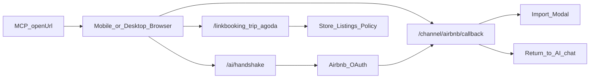

# 海外 AI Onboarding 交接（给 Xcode）

> 读者：Xcode（后续跟进）  
> 更新日期：2026-10-09  
> 仓库：MCP `localsbnbAi`；海外 PC `overseas/localsbnb`  
> 目标环境：**hudson-dev** + `https://overseas-dev.localhome.cn`；**S06 已完成：2026-10-08 17:31（北京时间）经 Cursor 宿主 `start_handshake` 返回 HTTPS 开链，17:43 用户确认浏览器到达 Airbnb 授权页**（见第 0.8 节）。真实 Airbnb 账号验收继续暂缓。MCP 改动仍未提交。

本文是跟进入口。方案细节见 [ai-onboarding-ops-plan.zh-CN.md](./ai-onboarding-ops-plan.zh-CN.md)，安装见 [getting-started.zh-CN.md](./getting-started.zh-CN.md)。

<a id="execution-progress"></a>

## 当前执行位置（接手先看，2026-10-09）

**S08 / S09 人工验收已通过（2026-10-09）。** S09 含真实写入与回查；S08 流程通过但**暂无真实渠道账号**做完整真连。AI 唤起页移动端与六语文案已在海外 PC + MCP 落地（见第 0.12 节）。MCP 工作区仍未提交/发布；海外 PC 移动端改动待该仓库提交并发布到 overseas-dev。S07 暂停；S05/S06 保持通过；S10 仍暂缓。下一棒优先：整理并提交 MCP，并发布海外 PC 移动端改动。

- **当前验证步骤：S09 人工验收通过；S08 通过（无真实渠道账号）；移动端布局 DevTools 375 已过。** 详见第 0.11 / 0.12 节与 [验收用例](./s08-s09-acceptance.zh-CN.md)。
- **当前开发：S08、S09 + 脏净房 + AI 唤起页移动端。** 渠道连接/查询/映射，改价/开关房/录单/脏净房，以及开链页窄屏与六语已接入。详见第 0.10–0.12 节。
- **S07 状态：按用户要求暂停。** Redis 提案仍待审核，未修改 ticket 状态机或共享存储。待用户恢复此步骤后再继续。
- **暂缓项：S10；S08 真连账号；移动端真机联调。** Airbnb / Booking/Trip/Agoda 真实渠道账号与真机 Safari/Chrome 补测不阻塞提交。
- **追加修复：Handshake API 环境一致性。** `/camps/get` 的 `COMMON_PERMISSION_DENIED` 仍为独立待办；证据见第 0.9 节。
- **体验补齐：AI 唤起页移动端。** 须在手机浏览器可用；文案六语（en/zh-CN/zh-TW/ja/th/ms）。详见第 0.12 节。

状态含义：**已完成**只覆盖本行明确的范围；**待执行**已有实现、仍需操作；**待开发**代码尚未完成；**暂缓**保留验收任务。测试通过、提交、发布、在线验收分别记录。

| 步骤 | 要完成的工作 | 当前状态 | 完成依据 / 尚缺什么 |
|------|--------------|----------|---------------------|
| S01 | P0 注册、登录、MFA、App Secret 落盘及 MCP bootstrap | 已完成实现，未提交 | MCP 类型检查和相关 39 项测试通过；历史记录含 hudson-dev 联调。本行 P0/P1 原始范围见第 0.2 节；当前全工作区含新增 S08/S09 及验收用例文档，共 37 个修改/新增文件 |
| S02 | P1 PC Handshake 基础代码、编译修复及 dev 发布 | 已完成 | `9c3ab4a` 基础实现、`8407864` 编译修复，已合入 `dev / 64f3cef`；用户确认发布，接口已恢复 |
| S03 | 发布后复测 create、ticket、HTTPS 页面 Cookie | 已完成接口检查 | 无凭证 400、真实 ticket 200、HTTPS 页面 Cookie 与门店匹配；发现原始 openUrl 为 HTTP |
| S04 | 修复原始 openUrl 的 HTTPS 协议并本地验证 | 已完成 | PC 3 个文件改动，13 项回归测试及完整 dev 构建通过；现已由 `4d0fd73` 提交 |
| S05 | 提交发布 S04 修复，验证原始链接直接为 HTTPS | 已完成 | 用户确认发布；2026-10-08 09:56 原始 openUrl 为 HTTPS，新 ticket 页面 200，Cookie / campId 匹配 |
| S06 | 经实际 MCP 宿主验证 Handshake 工具，开链到达 Airbnb 授权页 | **已完成，最近完成步骤** | 2026-10-08 17:31 Cursor 宿主工具列表含四个 Handshake 工具；`start_handshake` 返回 HTTPS（主机 overseas-dev），17:43 用户确认浏览器到达授权页。未授权、未导入。源码仍基于 `f9e040c` 未提交，无新提交号 |
| S07 | P1 ticket 一次性消费、状态关联、共享存储与权限 | **暂停：用户明确要求** | 原有缺口及 Redis 提案保留；本轮不推进此步骤 |
| S08 | P2 Booking / Trip / Agoda 渠道连接 | **人工验收通过；暂无真实渠道账号；未提交/发布** | 开浏览器页/“已完成”核对流程与工具验收通过；完整真连待有测试渠道账号后补齐；移动端见 0.12 |
| S09 | P3 改价、开关房、手工录单（含脏净房） | **人工验收通过（含真实写入）；未提交/发布** | 预览确认、写入与回查在 hudson-dev / overseas-dev 通过；另验 `update_room_clean_state`；详见第 0.11 节 |
| S10 | 真实 Airbnb OAuth → poll → listing 预览 → 确认导入 | **暂缓验收** | 无可授权账号；账号可用后补齐，不标记通过，不阻塞继续编码 |
| 体验 | AI 唤起页移动端 + 六语 | **代码已落地；DevTools 375 通过；真机待补；PC 待发布** | viewport、BookingLink/Airbnb 窄屏、AI 回调轻量壳、六语文案；详见第 0.12 节 |

**当前仓库落点：** MCP 最近核查为 `main / f9e040c`，交接与方案文档本身也未跟踪；当前共 37 个文件：13 个已跟踪文件修改、24 个未跟踪新文件；包括 Redis 提案与本轮 5 个新模块、3 个测试文件。PC 为 `dev / 9e4a367`，第 0.9 节的 2 个文件已提交，本次提交后工作区干净；已推送 origin/dev，线上环境隔离已验证，初始化权限问题待处理。当前 MCP 包版本仍为 `1.0.15`，不能据此认为公开 npm 包包含工作区新功能。本次未 fetch，远端信息仅来自本机缓存。

每个待执行步骤的操作、完成标准及需要记录的证据见[第 7 节](#execution-steps)。第 0 节保留历史过程，用于追溯；其中旧提交位置、工作区状态与 404 记录不覆盖本节当前状态。

---

## 0. 接手核查快照（2026-10-06）

本节区分 Git 已提交、工作区实现、历史联调记录和本次实测。Git 信息来自本机分支及已缓存的远端跟踪引用，本次未 fetch，也未 commit / push。本文及方案文档自身仍是未跟踪文件，换机器仅拉 Git 不会获得当前 MCP P0/P1 实现。

### 0.1 已提交内容

| 仓库 | 分支 / 提交 | 已确认范围 |
|------|-------------|------------|
| MCP `/Users/lijitao/loclas/cursor/localsbnbAi` | 当前 `main`，`f9e040c`，2026-09-08；本机 `github/main` 同提交 | 海外版 1.0.15：门店地域识别、语言/时区/币种、海外查询适配、入住/退房/续住/排房与安装文档；**不含本轮注册登录和 Handshake** |
| PC `/Users/lijitao/loclas/overseas/localsbnb` | 当前 `feat/newAi`，`9c3ab4a`，2026-10-06 23:04，提交名「兼容ai」 | 14 个文件：ticket 存储与 create API、Handshake 页、OAuth `src=ai`、回调完成页、公共路由放行、Token header 适配、六种语言文案；工作区干净 |
| PC `dev` | `a41482f`，2026-10-06 23:06 | 已合入上述 `feat/newAi`；本机 `origin/dev` 同提交。当前本机 `main` / `origin/main` 仍在 `68b5c53`，不含 AI 提交 |

**合入 dev 不等于部署验收通过。** 23:31 对 `POST https://overseas-dev.localhome.cn/api/ai/handshake/create` 发送无凭证空 JSON，实测 `HTTP 404`、`Content-Type: text/html`。按当前 create.ts 实现，应返回 `HTTP 400` 的 JSON `COMMON_PARAM_ERR`。该请求未创建 ticket。随后用户提供部署日志，确认构建失败，具体原因和修复见第 0.4 节。

### 0.2 MCP 尚未提交的完整范围

核查时共 **27 个文件：13 个已跟踪文件修改 + 14 个新文件**，暂存区为空。以下均为本轮工作区内容，不属于 `f9e040c`：

| 分类 | 修改文件 | 新文件 |
|------|----------|--------|
| 身份与启动 | `src/auth/apiKeyManager.ts`、`src/auth/index.ts`、`src/auth/permissionChecker.ts`、`src/client/httpClient.ts`、`src/server.ts`、`src/types/mcp.ts` | `src/auth/credentialsStore.ts`、`src/auth/hudsonToken.ts`、`src/tools/auth/onboarding.ts` |
| Handshake 与工具注册 | `src/config/tools.ts` | `src/auth/handshakeTickets.ts`、`src/auth/openSystemBrowser.ts`、`src/tools/auth/handshake.ts` |
| 包与启动示例 | `package.json` | `mcp.bootstrap.sample.json` |
| 文档 | `docs/overseas/README.md`、`getting-started.en.md`、`getting-started.zh-CN.md`、`tools.zh-CN.md`（后三项均在同目录） | 本文、`docs/overseas/ai-onboarding-ops-plan.zh-CN.md` |
| 测试 | `tests/region.test.ts` | `tests/auth.onboarding.test.ts`、`tests/credentialsStore.test.ts`、`tests/handshake.test.ts`、`tests/hudsonToken.test.ts`、`tests/openSystemBrowser.test.ts` |

`package.json` 仍为 **1.0.15**，本轮只改启动文件执行权限和打包文件列表。本次未核查 npm registry；不能凭安装文档中的 `npx localsbnb-mcp-server` 判断公开包已含 P0/P1。接手联调优先使用本文第 2 节的本地构建绝对路径。`mcp.bootstrap.sample.json` 目前也含本机 Node/仓库绝对路径，且是单个 server 条目映射，使用时需适配宿主的 `mcpServers` 包装。

### 0.3 本次检查结果与文档差异

- `npm run type-check`：通过（检查 src，不含 tests）。
- `npm test -- --runInBand --watchman=false tests/auth.onboarding.test.ts tests/credentialsStore.test.ts tests/handshake.test.ts tests/hudsonToken.test.ts tests/openSystemBrowser.test.ts tests/region.test.ts`：**6 个测试套件、39 项通过**。初次默认 Watchman 因本机权限失败，关闭 Watchman 后通过。
- 上述是本地单测，**不证明真实 Airbnb OAuth、PC 构建或在线导入通过**。未重新注册/登录、未发送 OTP、未执行房源导入，也未重建 dist 或重启宿主 MCP。
- 无凭证时实际只暴露 **4 个 auth 工具**；Handshake 要等登录并识别为海外店后才出现。方案第 5.1 节原有「auth / handshake」描述过宽。
- 当前回调是**浏览器中的 PC callback 页面经 API service 调用 Hudson `/oauth/code-authorize`**；实际换码由 Hudson 完成。没有实现方案要求的「Next Handshake 服务端接管回调并更新 ticket」流程。
- PC ticket TTL 为 **25 分钟**，实现只写 `pending → opened`；虽然类型声明 `consumed`，并无消费完成逻辑，也无 `succeeded/failed` 更新和 ticket 状态查询 API。有效期内可再次打开；OAuth state 含 nonce、campId、`src=ai`，**未绑定 ticketId**。
- MCP 在 `~/.localsbnb/handshakes.json` 保存账号基线；`poll_handshake` 比较账号新增、过期标记及 `lastSyncTime`，不查询 PC ticket。后台同步导致 `lastSyncTime` 变化也可能被判成功；同账号重授权未改变这些字段则可能一直 pending。联调须同时核对浏览器结果与账号状态。
- PC ticket 文件保存原始 token，且写文件未显式设置 `0600`；与 MCP credentials 的权限保护不同。多实例共享、并发写入、一次性消费与文件权限需在生产前处理。

项目范围是 **TypeScript MCP + Next.js Web**，当前 MCP 仓库没有原生 Xcode 工程。后续即使换编辑器，编译/测试/启动仍使用 Node/npm；本文第 2 节 JSON 是 MCP 宿主配置示例，不是 Xcode 工程配置。

### 0.4 历史部署失败与修复记录（最新状态见 0.5）

上述 Git 状态为最初核查快照。用户随后提供的 Docker 日志显示：

- `npm ci` 已完成；Docker **Step 16/37** 的 `NEXT_PUBLIC_API_ENV=dev` / `npm run build` 失败。
- Next.js 14.2.33 在类型检查阶段报 `lib/api/client.ts:208:75`：`string | null` 不能传给要求 `string` 的参数，构建退出码为 1。
- 原因：`getAuthToken()` 返回 `string | null`，新接入的 `formatHudsonAccessTokenHeader(token: string)` 调用未处理 null。npm deprecated/audit 与 ESLint Warning 不是本次中止点。
- 已在 PC 当前 `feat/newAi` 工作区修复：`formatHudsonAccessTokenHeader(token ?? '')`。无 token 时仍发送空 header；JWT / App Secret 格式逻辑保持不变。
- 本地构建继续暴露第二处错误：`pages/channel/airbnb/callback.tsx:237` 的 `currentCampId` 也可能为 null。已将导入分支条件改为 `accountId && currentCampId`，缺少门店时沿用账号列表兜底。当时两处修复尚未提交；后续已由 `8407864` 提交并合入 dev，见第 0.5 节。
- **本地 PC 完整构建已通过**：使用本机 Node 22.23.2、Next.js 14.2.33，执行 `NEXT_PUBLIC_API_ENV=dev NEXT_TELEMETRY_DISABLED=1 npm run build`，退出码 0，包含类型检查、优化打包、页面生成和 postbuild。最初 shell 默认 Node 16 不满足 Next.js 要求，切换已有 Node 22 后验证；未运行 Docker/CI 构建（用户日志中的镜像为 Node 18）。
- 单独运行全仓库 `tsc --noEmit --incremental false` 时还发现 `__tests__/components/ChartContainer.test.tsx` 的 4 处 jest-dom matcher 类型缺失；它们不阻断上述 Next.js 构建，本次未修改测试基础配置。
- 当时待办为提交修复并重新发布；现已完成发布后接口复测。完整 OAuth 真连仍未完成。

### 0.5 发布后在线复测（2026-10-07，北京时间 00:09 起）

用户确认已发布后复测，PC 当前本机分支为 `dev`，HEAD `64f3cef`（合并 `feat/newAi`），包含修复提交 `8407864`「bug修复」；工作区干净。本次未 fetch，未改 PC 业务代码或部署配置。

| 检查 | 实际结果 |
|------|----------|
| 空 JSON、无凭证 POST create | **HTTP 400 + JSON `COMMON_PARAM_ERR`**，旧 HTML 404 已消失 |
| GET create | **HTTP 405 + `METHOD_NOT_ALLOWED`**，`Allow: POST` |
| 不存在的 ticket 页面 | HTTP 200，命中 `/ai/handshake/[ticketId]`，页面错误态 `expired`，不设置 Cookie |
| 本机已有凭证创建真实 ticket（用户明确授权） | **HTTP 200、success=true**，返回 ticketId，TTL 约 **1500 秒 / 25 分钟** |
| 返回 openUrl | 主机为 `overseas-dev.localhome.cn`，路径匹配 ticket，无 query/fragment；**协议错误地为 `http`** |
| 将该 ticket 链接强制使用 HTTPS 后读取页面 | **HTTP 200**；`localsbnb_auth_token` 与 expiry Cookie 均返回，token 与本机凭证匹配，页面 campId 匹配，无错误态 |

**待处理：openUrl 必须返回 HTTPS。** `pages/api/ai/handshake/create.ts` 的 `publicOrigin()` 优先读取 `NEXT_PUBLIC_SITE_URL` / `SITE_URL`，否则读取 `x-forwarded-proto`，缺失时退回 `http`。本次未读取部署环境变量或代理配置，尚不能断定是站点配置为 HTTP，还是代理未正确传递协议。建议检查 PC 站点 origin 配置为 `https://overseas-dev.localhome.cn`，并检查 HTTPS 代理向 Next.js 传递 `X-Forwarded-Proto: https`。若 `NEXT_PUBLIC_SITE_URL` 已设置，会优先于 `SITE_URL`，需一并核实。

本次使用 HTTP 客户端验证服务端响应，**未运行浏览器 JS 跳转、未执行 Airbnb OAuth、poll 成功或房源导入**。测试共创建 2 个短期 ticket；未输出 token、Cookie 值或完整 ticket 链接。单次 create → page 成功也不代表多实例共享存储已通过验证。

### 0.6 HTTPS 代码修复与暂缓真连（2026-10-07）

用户确认暂时没有可测试的 Airbnb 账号，允许以现有接口、Cookie 与本地检查结果继续开发。**真实 OAuth / poll 成功 / 导入验收保持“暂缓”，不记为已实测通过，也不阻塞后续代码编写。** 有可授权账号后再补齐。

PC 当前 `dev` 工作区新增以下未提交改动：

| 文件 | 改动 |
|------|------|
| `lib/ai/handshakeOrigin.ts`（新增） | 统一解析站点 origin；非 loopback 主机统一 HTTPS；localhost、127.0.0.1、IPv6 loopback 保留 HTTP 本地开发能力；保留环境变量优先级 |
| `pages/api/ai/handshake/create.ts` | 使用新的 origin 解析函数生成 openUrl；创建 ticket 前先校验 origin |
| `__tests__/lib/ai/handshakeOrigin.test.ts`（新增） | 覆盖代理协议头缺失/HTTP/多值、站点配置优先级、公网 HTTP 配置、本机开发和无效 origin |

验证：**13 项回归测试通过**；Node 22.23.2 下 `NEXT_PUBLIC_API_ENV=dev NEXT_TELEMETRY_DISABLED=1 npm run build` **完整通过**。本节记录的是当时尚未提交发布的状态；后续已提交并通过线上复测，见第 0.7 节。

### 0.7 S05 发布验收完成（2026-10-08 09:56，北京时间）

用户确认海外 dev 再次发布后复测。本机 PC 当前 `dev / 4d0fd73`「bug修复」包含 HTTPS 改动，工作区干净。发布状态由用户确认，并有以下在线行为证据；本次未读取 CI 流水线或服务器构建 SHA。

| 检查 | 本次结果 |
|------|----------|
| 无凭证空 JSON POST create | HTTP 400 + JSON `COMMON_PARAM_ERR` |
| 已授权的本机凭证创建新 ticket | HTTP 200、success=true，有效期约 1500 秒 |
| API 原始 openUrl | **直接为 HTTPS**，主机 `overseas-dev.localhome.cn`，路径匹配 ticketId，无 query/fragment |
| 直接访问原始 openUrl | HTTP 200，未手工改协议，无页面错误态 |
| 会话 Cookie 与门店 | auth / expiry Cookie 均设置；token 与本机凭证一致、campId 匹配 |

**结论：S05 完成，HTTP 链接问题已在线验证解决。** 本次创建 1 个短期 ticket，沿用此前用户明确授权；未输出 token、Cookie 值或完整 ticket 链接。未执行浏览器 JS、Airbnb 官网授权、MCP poll 或房源导入。S06 的宿主开链验证见第 0.8 节；S10 仍暂缓。S07 等待存储方式确认。

### 0.8 S06 宿主开链验收完成（2026-10-08 17:43，北京时间）

用户确认 S06 测试通过。本次在 Cursor 宿主「LocalsBnb Locals MCP」直接调用 `start_handshake`（`type=airbnb_oauth`），未调用 `poll_handshake`，未导入房源，也未在授权页完成登录。

| 检查 | 本次结果 |
|------|----------|
| 宿主 | Cursor，MCP 名称 LocalsBnb Locals MCP |
| 工具列表 | 含 `start_handshake`、`poll_handshake`、`list_channel_accounts`、`import_airbnb_listings`；能挂载表示门店已被识别为海外 |
| 调用时间 | 2026-10-08 17:31 |
| 返回 openUrl | **直接为 HTTPS**，主机 `overseas-dev.localhome.cn`，路径为 Handshake ticket，无 query/fragment |
| 系统浏览器 | 工具报告已尝试打开一次 |
| 授权页 | 17:43 用户确认已到达 Airbnb 授权页 |
| 此前 `USER_TOKEN_INVALID` | 不再阻碍本次开链到达授权页 |

**结论：S06 开链验证完成。** 完成范围是宿主工具可见，且开链到达 Airbnb 授权页。MCP 工作区仍基于 `main / f9e040c`，P0/P1 改动与本文都未提交，因此没有新的 MCP 提交号。本轮未重新执行 `npm run build`，也未记录构建或重启时间；以宿主已经能调用这四个新工具，作为当前进程加载了新实现的证据。未输出 token、Cookie 或完整 ticket 链接。S10 继续暂缓。下一执行项为 S07。

---

### 0.9 Handshake API 环境一致性修复（2026-10-08 21:50，线上生效，另有权限问题）

**已知事实：** 用户提供的失败请求为 `POST https://hudson-prod.localhome.cn/camps/get`，Origin 为 `https://overseas-dev.localhome.cn`，`campid: 0`，返回 `USER_TOKEN_INVALID`。请求跨到了与目标 dev 不同的 Hudson 环境；不能仅凭这个响应认定凭证自身失效。App Secret 使用原值、JWT 使用 Bearer 的既有规则保持不变。此次未重放用户提供的凭证。

**代码定位：** 原浏览器 `getApiBaseUrl()` 优先使用 localStorage 的 `localsbnb_api_env`，而 ticket 创建接口使用服务端配置，存在服务端验证 dev、浏览器随后请求 prod 的路径。历史环境选择是代码确认的可能原因，尚未读取用户浏览器实际存储值；发布配置本身也需核对。

**本地改动（PC，已提交 `dev / 9e4a367`，已推送 origin/dev，线上环境隔离已验证，初始化权限问题待处理）：**

- `lib/api/config.ts`：Handshake 页面及 `state.src=ai` 的 Airbnb 回调忽略浏览器历史环境选择，沿用服务端配置优先级（`NEXT_PUBLIC_API_URL` 或构建默认环境）；覆盖六种语言路径及 Mock 判定。普通页面与 App 回调仍保留原环境切换行为。
- `__tests__/lib/ai/handshakeApiEnv.test.ts`：新增 20 项回归，覆盖历史 prod/uat/mock、语言路径、显式 API URL、真实 prod 构建与普通页面行为。

**验证：** 上述测试及 `handshakeOrigin.test.ts` 共 **33 项通过**；Node 22.23.2 下 `NEXT_PUBLIC_API_ENV=dev NEXT_TELEMETRY_DISABLED=1 npm run build` 完整通过。构建仍有项目现存 lint 警告。线上隔离浏览器复测结果见下表；未完成真实 OAuth 或导入。

**发布后实测（北京时间 2026-10-08 21:50）：** 已推送 `origin/dev / 9e4a367`。未直接读取 Jenkins 控制台或构建号；通过线上 JS 包含修复逻辑及真实浏览器行为确认发布效果。

| 检查 | 结果 |
|------|------|
| 新建真实短期 ticket | HTTP 200，`success=true` |
| 原始 openUrl | HTTPS，主机为 overseas-dev |
| ticket 页面 | HTTP 200，无 page error，campId 匹配 |
| Cookie | token 与本机凭证匹配，expiry 有效；不记录值 |
| 浏览器历史环境 | 隔离 Chrome 上下文预置并保持 `localsbnb_api_env=prod` |
| 线上 JS | 包含 AI Handshake / AI callback 环境隔离逻辑 |
| 实际 `/camps/get` | **请求 Hudson dev**，HTTP 200，业务 `success=false`、`COMMON_PERMISSION_DENIED` |
| 错误环境请求 | 设置拦截，未观察到 Hudson prod 请求 |
| Airbnb 跳转 | 页面发起导航，测试拦截并返回 204；未访问授权页或执行授权 |

此次创建 1 个真实 ticket，使用此前已获授权的本机凭证。为了限定测试范围，拦截了 `/traceLog` 写入。测试不输出 token、Cookie、完整 ticket 或业务响应数据。一次性自动跟进已停用。

**结论：** 环境错配修复在线通过，本次不再出现 `USER_TOKEN_INVALID`；但初始化接口存在新的权限失败，不能宣称整体初始化或 OAuth 流程通过。`COMMON_PERMISSION_DENIED` 的具体原因尚未确认；App Secret 与用户级接口的权限差异是待核查方向。ticket 创建对指定门店的校验通过，与用户企业列表初始化失败是两个独立结果。

**下一步按顺序执行：**

1. 核对 `/camps/get` 对 App Secret 的权限契约，以及 AI Handshake 是否需要运行普通用户的完整初始化。当前 `AuthContext.initializeSystem()` 先读取全部企业，再选择第一个企业；不能直接假设 ticket 中的门店已被浏览器初始化使用。
2. 根据契约修复 AI 专用初始化，使其使用 ticket 绑定门店和适用的接口；保留普通用户登录流程，补权限失败与门店绑定回归测试，再提交发布复测。不要通过给 App Secret 随意添加 Bearer 来规避权限问题。
3. 有可用 Airbnb 账号后，在 S10 验证 `src=ai` 回调换码、poll 与导入；本次只对 Handshake 初始化做真实浏览器检查，回调环境规则仅有本地测试及线上代码证据。

### 0.10 S08 / S09 本地开发完成（2026-10-09，未提交、未发布）

用户明确暂停 S07，先开发 S08/S09。本轮只修改 MCP 项目；海外 PC 保持 `dev / 9e4a367`，未改动 PC 或继续推进 Redis/ticket 流程。

| 新工具 | 实现范围与接口 |
|--------|----------------|
| `connect_channel_poi` | Booking 9 / Trip 113 / Agoda 10；固定 accountId 与 PC `poi.ts` 一致；先检查已有 POI，预览后 `/poi/createChannelPoi` |
| `query_channel_connection` | `/channelRoomCategories/bnb/get` 状态、门店/房型/产品关联；分页读取 `/bnbListings/page/get` 本地候选 |
| `map_channel_listing` | `/poiMapping/bnb` 门店映射、`/roomCategoryMapping/bnb` 房型/可选产品映射；校验来源、目标及已关联门店范围，Trip 增加 `isPublish:0` |
| `update_channel_prices` | 查询 `/bnbRatePrice/channelPrice/get` 后 `/save`；确认可修改标志、原价、日期和周日优先的 validWeekDays；金额分，范围 10–999999999，与 PC 一致 |
| `close_rooms` / `open_rooms` | 校验房间、预订和占用后 `/bnbRoomStatuses/close` 或 `/open`；仅手动类型 1/4/5，不解除订单或联动占用 |
| `create_manual_order` | 校验门店房间与占用，`/bnbOrder/calcPayout` 报价后 `/bnbOrder/save`；手工 channelId/orderChannelId=0、orderOpFromType=1、reserved 状态=2；报价折扣从房费扣除，清洁费/税按 PC 规则提交 |
| `update_room_clean_state` | 校验房间后 `/room/updateCleanState`；`cleanState` 0–3 或 dirty/clean 等；预览确认后写入并回查 |

**S08 默认交互（本轮追加）：** `start_channel_connection(channel)` 在打开 PC 前记录对应渠道 POI 与映射快照，避免用户操作被纳入基线；打开对应 `/linkbooking`、`/linktrip`、`/linkagoda`。用户只回复“已完成”，LLM 调用无参数 `complete_channel_connection`。新增或有实际映射/状态变化且门店、全部房型及返回的产品关联正常才结束。无变化/同步中保留基线，异常提示回 PC 处理，之后仍只需回复“已完成”。记录在客户端内存，1 小时有效；绑定门店/凭证，重启失效，一次只跟进一个渠道。不涉及 S07 Redis 或 ticket；PC 沿用现有登录态，不注入 Cookie。

**实现文件：** 新增 `src/tools/overseas/channels.ts`、`operations.ts`、`operationTools.ts`、`mutationPreview.ts`、`channelConnectionFlow.ts`；修改工具注册、权限场景、HTTP 客户端/请求类型及参数日志脱敏。新增 `tests/overseas.operations.test.ts`、`tests/httpClient.mutations.test.ts`、`tests/channelConnectionFlow.test.ts`。原有 P0/P1 未提交改动保留。

**确认约束：** 先读取资源并返回完整预览；10 分钟有效的 `previewId` 绑定客户端、凭证、门店、工具、参数与当前报价/资源快照。用户确认后，保持原参数并传布尔 `confirm=true`；过期、错门店、报价/映射变化会拒绝写入。提交前消费预览（同内容预览同时失效），显式关闭写请求自动重试。写入成功后自动只读回查，结果标为 `submitted`；`readBackStatus=read` 仅表示已读回数据，需要比较结果，异步渠道同步不直接标成功。回查失败单独标记，不能因此重写。

此预览凭据只在 MCP 进程内存保存，不是 S07 的 Handshake ticket，不依赖 Redis；重启或切换客户端后需要重新预览。服务端仍负责最终权限和并发库存检查；本地读取检查不能替代后端事务/幂等能力。

**本地验证：** Node 22.23.2；类型检查通过、`npm run build` 通过；离线测试套件通过；新 PC 流程与工具定义 lint 通过。测试排除 `overseas.live.test.ts`、`overseas.smoke.test.ts`。

**边界：** 查询/改价/开关房单次最多 91 个业务日期；单房日租录单最多 90 晚，不支持小时房、多房合单、取消或收款。手工报价显示全部返回项，提交房费（已扣折扣）、清洁费、税和已付金额，与当前 PC 表单一致；录单状态对齐 PC NewOrderDrawer（reserved / state 2）。新工具 description 暂为英文。调用见 [工具说明](./tools.zh-CN.md)，验收见 [S08/S09 人工验收用例](./s08-s09-acceptance.zh-CN.md) 与第 0.11 节。

### 0.11 S08 / S09 人工验收通过（2026-10-09）

用户确认：**S08、S09 已测试完毕并通过。**

| 步骤 | 验收结论 | 说明 |
|------|----------|------|
| S08 | **通过（暂无真实渠道账号）** | 开页、快照、“已完成”核对等流程与工具在宿主侧验收通过；Booking/Trip/Agoda **完整真连**待有测试渠道账号后补测，不记为已真连 |
| S09 | **通过（含真实写入）** | 改价、关房、开房、录单在测试门店完成预览→确认→回查；另验脏净房 `update_room_clean_state`（脏房/净房） |

**宿主注意：** Cursor 工具列表可能缓存旧 schema；本机将 MCP 服务名改为 `Locals Overseas` 指向本地 `dist/run.cjs` 后可见含 `update_room_clean_state` 的完整列表。勿用全局 npm 旧包冒充本轮功能。

**下一步：** 整理并提交 MCP 工作区；有渠道/Airbnb 测试账号后再补 S08 真连与 S10。

### 0.12 AI 唤起页移动端适配（2026-10-09，海外 PC + MCP 用语）

**要求：** MCP 打开的页面不得假设仅桌面；用户可能用手机浏览器完成关联。开链/渠道页须在约 375 宽可用；新增用户可见文案走海外站六语。



| 页面 | 目标 |
|------|------|
| `/linkbooking` `/linktrip` `/linkagoda` | 约 375 宽可完成直连步骤；主 CTA 可见；无整页横溢 |
| `/ai/handshake/[ticketId]` | 保持轻量全屏跳转 |
| `/channel/airbnb/callback` + 导入弹窗 | AI 完成态轻量壳；导入弹窗窄屏可用 |
| 国际化 | 新增可见文案走 `common.json` 六语（en/zh-CN/zh-TW/ja/th/ms）；组件禁止硬编码 |

**本轮已落地（代码）：**
- 海外站 `_document.tsx` 补 `viewport`
- `BookingLinkFlow`：Agree/Cancel 窄屏纵向、示意图 `lg` 以下隐藏、step3 最小高度放宽；Listings/Store/Policy 底栏与筛选换行
- Airbnb：`AirbnbLinkFlow` 取消硬编码 `minHeight:426`（改为 md 断点）；AI 回调轻量壳（无 Dashboard）；未登录可读错误 `sessionMissing`；导入弹窗列表 `min(276px,40dvh)`、footer 全宽按钮
- 六语已同步：`returnToChatDesc`、`aiHandshake.redirecting`、`errors.sessionMissing`
- MCP：`channelConnectionFlow` / `handshake` 用户提示改为「浏览器页面（手机或桌面均可）」；宿主服务名现为 **`Locals Overseas`**（原 `LocalsBnb Locals MCP`，为刷新工具列表缓存而改名）

**手测回填（2026-10-09）：** DevTools 375 布局检查已通过（viewport / 主 CTA / 无整页横溢）；真机 Safari/Chrome 与完整渠道账号联调仍待有测试资源时补测。桌面 ≥1280 未做破坏性回退。渠道详情宽表仍横滚（P2，操作列可滑到）。**海外 PC 改动尚未提交/发布到 overseas-dev**，线上需发布后方可对真实用户生效。

## 1. 当前结论（先看这里）

| 项 | 状态 |
|----|------|
| P0 邮箱注册 / 登录 / 落盘 App Secret | **已实现**，hudson-dev 真连过 |
| 直配 `APP_SECRET` + `APP_ID` | **不能改坏**；env 优先于 `~/.localsbnb/credentials.json` |
| P1 Handshake 基础代码（PC + MCP） | **已实现基础链路**；ticket 消费、状态关联和共享存储仍属 S07 待开发 |
| **overseas-dev 部署可用性** | **S05 已完成**：原始 HTTPS openUrl、新 ticket 页面、Cookie 在线复测成功 |
| 自动唤起系统浏览器 | **S06 已完成**：2026-10-08 17:31 Cursor 宿主 `start_handshake` 尝试打开系统浏览器，17:43 用户确认到达 Airbnb 授权页 |
| Airbnb 官网授权 | **暂缓验收**：缺少可授权账号，用户同意不阻塞后续开发；不视为真连通过 |
| MCP 进程里出现 `start_handshake` | **S06 已完成**：Cursor 宿主已暴露 Handshake 工具（当前服务名 `Locals Overseas`） |
| S08 / S09 | **人工验收通过**（S08 暂无真实渠道账号；S09 含真实写入与脏净房） |
| AI 唤起页移动端 | **代码已落地**；DevTools 375 通过；真机与 overseas-dev 发布待补 |

下一棒优先：**提交 MCP 工作区，并提交/发布海外 PC 移动端改动。** S07 暂停，[Redis 提案](./ai-handshake-redis-proposal.zh-CN.md) 保持待审核；第 0.9 节初始化权限问题保留。S08 真连账号与 S10 Airbnb 账号到位后补测。

---

## 2. 给 Xcode 的联调配置

完整 OAuth（接口与 HTTPS 返回链接已发布验证，真实账号联调暂缓）：

```json
{
  "mcpServers": {
    "Locals Overseas": {
      "command": "node",
      "args": ["<本机>/localsbnbAi/dist/run.cjs"],
      "env": {
        "NODE_ENV": "development",
        "LUKEYUN_API_BASE_URL": "https://hudson-dev.localhome.cn",
        "LOCALSBNB_SITE_URL": "https://overseas-dev.localhome.cn"
      }
    }
  }
}
```

- 改完 **源码必须 `npm run build`**，Cursor 指向的是 `dist/run.cjs`。
- **必须重启** Cursor 里的 MCP，工具列表才会变。若工具列表仍缺新工具（如 `update_room_clean_state`），可改服务名强制刷新缓存（当前推荐名 `Locals Overseas`）；勿混用全局 npm 旧包「LocalsBnb MCP」。
- 无 `APP_SECRET` / `APP_ID` 时从 `~/.localsbnb/credentials.json` 读；两者都配则走直配，**不读文件**。
- 本地只测开链/种 cookie 时才把 `LOCALSBNB_SITE_URL` 设为 `http://localhost:3000`，且 3000 必须是海外 PC `next dev`，不能是别的 webpack。
- 开链页须支持**手机浏览器**；对话提示用「浏览器页面（手机或桌面均可）」，不要暗示只能在桌面完成。

对话话术：

1. 「帮我注册 LocalsBnb」或「登录 LocalsBnb」
2. 「连接 Airbnb」→ 应 `start_handshake`：先 `open`/`start`/`xdg-open` 一次，失败再给链接
3. 用户完成 Airbnb 后：「我已完成 Airbnb 授权」→ `poll_handshake` → `import_airbnb_listings`（先预览，同一轮不要 `confirm=true`）
4. 「连接 Booking / Trip / Agoda」→ `start_channel_connection` → 用户在浏览器完成 →「已完成」→ `complete_channel_connection`
5. 「把 lhq 设为脏房 / 净房」→ `update_room_clean_state`（先预览再确认）

`LOCALSBNB_OPEN_BROWSER=0` 可关掉自动开浏览器。

---

## 3. Token 规则（已踩坑，勿回退）

`hudson-access-token`：

| 来源 | 加 `Bearer`？ |
|------|----------------|
| `POST /user/bnb/sign-in`、`/user/bnb/sign-up` 的短期 JWT | **要** |
| `POST /user/secret/generate` 或 `/user/secret/get`、mcp.json 直配 `APP_SECRET` | **不要**（裸传） |

实现：MCP `src/auth/hudsonToken.ts`；PC `lib/auth/hudsonAccessToken.ts`。三段式 `a.b.c` 当 JWT，其余当 App Secret。

注册/登录成功后 **禁止把登录 JWT 写入凭证**。流程：

1. 登录 JWT（Bearer）→ `POST /camps/get` 取第一家 `campId`
2. 同一 JWT → `/user/secret/get`，空则 `/user/secret/generate`
3. 把 **App Secret** + `campId` 写入 `~/.localsbnb/credentials.json`（mode 600）

注意：历史记录中 App Secret 调 `POST /camps/get` 可能返回 **空列表**；最新 2026-10-08 21:50 浏览器实测返回 **`COMMON_PERMISSION_DENIED`**，具体权限契约待核对。`POST /camp/get`（带 campId）可用。Handshake create 已改为用 `/camp/get` 校验会话，不要改回只认 `camps/get`。

发注册验证码必须带非空 `redirectUrl`（MCP 用 `LOCALSBNB_SITE_URL` 或站点 origin）。

---

## 4. 代码地图

### MCP（`localsbnbAi`）

| 路径 | 作用 |
|------|------|
| `src/auth/apiKeyManager.ts` | env 直配优先，否则读本地凭证 |
| `src/auth/credentialsStore.ts` | `~/.localsbnb/credentials.json` |
| `src/auth/hudsonToken.ts` | Bearer 规则 |
| `src/auth/openSystemBrowser.ts` | 唤起浏览器一次 |
| `src/tools/auth/onboarding.ts` | 注册/登录/换 App Secret |
| `src/tools/auth/handshake.ts` | `start_handshake` / `poll_handshake` / `list_channel_accounts` / `import_airbnb_listings` |
| `src/tools/overseas/channelConnectionFlow.ts` | S08：`start_channel_connection` / `complete_channel_connection` |
| `src/tools/overseas/operationTools.ts` / `operations.ts` | S09：改价、开关房、录单、脏净房等 |
| `src/tools/overseas/mutationPreview.ts` | 10 分钟 previewId 确认 |
| `src/config/tools.ts` | **仅 `region===overseas`（`isBnb===1`）才挂 Handshake / S08 / S09 工具** |
| `src/client/httpClient.ts` | 按 token 类型写 header；写请求关闭自动重试 |

### 海外 PC（`overseas/localsbnb`；Handshake HTTPS 已验证；移动端改动待提交发布）

| 路径 | 作用 |
|------|------|
| `pages/api/ai/handshake/create.ts` | 建 ticket，token 不进 URL |
| `pages/ai/handshake/[ticketId].tsx` | Set-Cookie 后跳 Airbnb，`src=ai` |
| `lib/ai/handshakeStore.ts` | **当前是本机临时文件**（见风险） |
| `pages/channel/airbnb/callback.tsx` | `src=ai` 时轻量壳 + Hudson 换码；成功后提示回 AI |
| `pages/linkbooking.tsx` 等 + `components/BookingLink/*` | Booking/Trip/Agoda 直连；窄屏适配见第 0.12 节 |
| `components/AirbnbLink/*` | Airbnb 授权卡与导入弹窗窄屏 |
| `pages/_document.tsx` | 全站 `viewport` |
| `public/locales/*/common.json` | 六语（含 AI 回对话、sessionMissing） |
| `lib/auth/hudsonAccessToken.ts` | 与 MCP 相同的 header 规则 |
| `lib/api/client.ts` | cookie 里可能是 JWT 或 App Secret |

Airbnb `redirect_uri`（不能按请求改）：

- dev：`https://overseas-dev.localhome.cn/channel/airbnb/callback`
- prod：`https://localsbnb.com/channel/airbnb/callback`

---

## 5. 已验证 / 未验证

**历史交接记录称已验证（hudson-dev + 本机或 PC Handshake；本次未重复真连）：**

- 邮箱占用检查、发 OTP（需 `redirectUrl`）、完成注册
- 登录 JWT + Bearer 可 `camps/get`
- generate 得到 32 位 App Secret；裸传可 `camp/get`，`isBnb=1`
- 本机 Handshake create + **系统浏览器唤起成功**
- 用户明确：暂无 Airbnb 可授权账号，**开链步骤算成功**

**在线验收清单（更新至 2026-10-09）：**

- [x] 核实 create API 部署：2026-10-07 已返回 HTTP 400 + JSON `COMMON_PARAM_ERR`，真实 ticket 创建也成功
- [x] create 返回链接主机为 overseas-dev，路径与 ticketId 匹配，有效期约 25 分钟
- [x] 用 HTTPS 请求真实 ticket 页面：HTTP 200，响应设置会话 Cookie，token 与 campId 匹配
- [x] openUrl HTTPS 代码修复：13 项本地测试及 PC 完整构建通过
- [x] 将 HTTPS 修复提交发布并复测原始 openUrl：`4d0fd73`；2026-10-08 原始链接直接为 HTTPS，页面与 Cookie 验证通过
- [x] 经实际 MCP `start_handshake` 验证返回的 openUrl 使用 HTTPS 且主机为 overseas-dev（2026-10-08 17:31，Cursor 宿主；未记录完整 ticket 链接）
- [x] 浏览器打开 Handshake 页并到达 Airbnb 授权页（17:43 用户确认；未在授权页完成登录或授权）
- [x] API 环境隔离：历史 `prod` 配置下，Handshake 初始化请求仍访问 Hudson dev（`9e4a367`，21:50 实测）
- [x] S08 渠道连接流程与工具人工验收通过（暂无真实渠道账号完整真连，2026-10-09）
- [x] S09 改价/开关房/录单/脏净房真实写入与回查通过（2026-10-09）
- [x] AI 唤起页移动端代码落地 + DevTools 375 布局检查（viewport / 主 CTA；真机待补，海外 PC 待发布）
- [ ] AI 初始化权限：`/camps/get` 返回 `COMMON_PERMISSION_DENIED`，尚未解决；不能用开链通过代替初始化成功
- [ ] Airbnb 回调换码成功，对话 `poll_handshake` 出现新 `accountId`（缺少真实账号，用户同意暂缓，不阻塞开发）
- [ ] `import_airbnb_listings` 预览后再 `confirm=true`（同上，暂缓实测）
- [ ] 移动端真机 Safari/Chrome + Booking/Trip/Agoda 真实账号联调
- [ ] 海外 PC 移动端改动提交并发布到 overseas-dev
- [x] Cursor 宿主工具列表出现四个 Handshake 工具（本次调用成功；工具能挂载表示门店已被识别为海外）
- [ ] 多实例 / 负载均衡下 ticket 仍能 create → open（见下一节）

---

## 6. 已知问题（跟进时优先）

**保留待办：AI 初始化权限失败。** 环境隔离已在线修复，但 `/camps/get` 在 Hudson dev 返回 `COMMON_PERMISSION_DENIED`。需核对 App Secret 权限与 ticket 门店初始化流程，详见第 0.9 节。尚未确认具体权限原因，不改成“凭证无效”或“已全部通过”。

0. **create 返回 HTTP openUrl：已解决**  
   编译失败、接口 404 及返回 HTTP 链接的问题均已解决；S05 于 2026-10-08 在线复测通过，见第 0.7 节。

1. **Handshake 工具可能不出现**  
   `getActiveToolDefinitions` 只在海外 profile 注册 Handshake。若 `/camp/get` 失败或 `isBnb!==1`，Cursor 里只有查询工具。联调时先看 `POST /camp/get` 的 `isBnb`。

2. **Ticket 存在 PC 进程临时文件**  
   `lib/ai/handshakeStore.ts` 默认 `os.tmpdir()/localsbnb-ai-handshakes.json`。overseas-dev 若多机或无持久盘，**create 与打开 Handshake 页可能不在同一实例**，表现为 ticket 过期/找不到。发版后若 404/expired，优先改成 Redis / Hudson / 共享存储。

3. **`poll_handshake` 看的是渠道账号列表变化**，不是 ticket 状态机。无 Airbnb 账号时不要用 poll 当失败依据；账号后台同步变化也可能误判成功（见第 0.3 节）。

4. **改 dist 必须重启 MCP**。未重启时即使用本机脚本调 PC Handshake，Cursor 工具列表也不会变。Cursor 可能缓存旧工具 schema；改名服务（如 `Locals Overseas`）或新开 Agent 对话可强制刷新。

5. **3000 端口可能被其它 webpack 占用**。`Cannot POST /api/ai/handshake/create` 说明不是海外 PC。

6. **AI 唤起页须兼顾手机浏览器**。海外 PC 已补 viewport 与窄屏布局（见第 0.12 节），须发布到 overseas-dev 后才对线上用户生效；真机联调仍待补。

---

<a id="execution-steps"></a>

## 7. 后续执行步骤与完成标准

S01–S06 的实现、测试和发布证据见上方进度表及第 0 节。S06 开链验证已完成；S08/S09 人工验收已通过（见第 0.11 节）；AI 唤起页移动端代码已落地（见第 0.12 节）。按用户要求暂停 S07。下一棒为提交 MCP 与发布海外 PC 移动端。第 0.9 节权限问题仍未解决。

### S05 · 发布 HTTPS 修复并复测【已完成：2026-10-08】

**已回填证据：** 本机提交 `4d0fd73`，用户确认海外 dev 发布，09:56 原始 HTTPS 链接及新 ticket Cookie 复测通过。详见第 0.7 节。以下保留执行方法，不需要将 S05 重新列为待办。

1. 在 PC 仓库 `/Users/lijitao/loclas/overseas/localsbnb` 检查 S04 的 3 个文件：`pages/api/ai/handshake/create.ts`、`lib/ai/handshakeOrigin.ts`、`__tests__/lib/ai/handshakeOrigin.test.ts`。
2. 将这 3 个文件提交并纳入 dev 发布。若源码有新修改，先重跑回归测试和 dev 构建；仅发布当前已验证内容时可引用第 0.6 节结果，CI 仍须成功。
3. 发布后发送空 JSON 到 `POST https://overseas-dev.localhome.cn/api/ai/handshake/create`，确认 HTTP 400 + JSON `COMMON_PARAM_ERR`。
4. 使用有效凭证创建**新 ticket**，检查 API 原始 `openUrl` 的协议和主机，再直接访问该 URL，验证页面与 Cookie。不要用已过期 ticket，也不要手工替换 HTTP 来判定修复成功。

**完成标准：** 原始链接直接为 `https://overseas-dev.localhome.cn/ai/handshake/{ticketId}`，页面 200，Cookie / campId 匹配。**回填：** 修复提交号、发布版本或流水线结果、复测时间和脱敏结果；然后把 S05 改为已完成。

### S06 · MCP 构建、宿主重启与开链验证【已完成：2026-10-08 17:43】

**已回填证据：** Cursor 宿主「LocalsBnb Locals MCP」于 17:31 调用 `start_handshake`，返回 HTTPS 开链并尝试打开系统浏览器；17:43 用户确认浏览器到达 Airbnb 授权页。详见第 0.8 节。此前 `USER_TOKEN_INVALID` 不再作为当前阻塞。以下保留执行方法，不需要将 S06 重新列为待办。

**此前接口错误（独立跟进）：** 开链通过仅覆盖到达授权页。用户补充请求后，已确认 overseas-dev 页面访问了 Hudson prod 的 `/camps/get`，返回 `USER_TOKEN_INVALID`；环境修复及复测见第 0.9 节。凭证值不写入文档。

1. 在 MCP 仓库确认第 0.2 节的 27 个修改/新增文件均被保留，整理提交代码与文档，防止切机器或 checkout 时丢失未跟踪文件；记录提交号。
2. 在仓库目录执行 `npm run type-check`、`npm run build`。使用第 2 节的本机绝对路径配置，确认 `LOCALSBNB_SITE_URL=https://overseas-dev.localhome.cn`，宿主实际加载新 `dist/run.cjs`。
3. 重启 MCP，确认门店 `isBnb===1`，工具列表包含 `start_handshake`、`poll_handshake`、`list_channel_accounts`、`import_airbnb_listings`；缺失时按第 6 节排查。
4. 从宿主调用 `start_handshake`，验证返回 HTTPS 链接、浏览器打开页面并跳到 Airbnb。没有 Airbnb 账号时，到授权登录页即可停止，S10 继续保持暂缓。

**完成标准：** 实际 MCP 进程暴露预期工具，开链流程到达 Airbnb 授权页。**回填：** 宿主为 Cursor「LocalsBnb Locals MCP」；工具列表含上述四个 Handshake 工具；17:31 返回 HTTPS 开链，17:43 用户确认到达授权页。MCP 提交号仍为基线 `f9e040c`（工作区未提交，无新提交号）；本轮未记录构建/重启时间。直接调用 PC API 的结果不代替本步骤，本次证据来自宿主工具调用。整理提交 MCP 改动仍未做，不计入本次测试通过范围。

### S07 · 补齐 P1 ticket 流程【用户要求暂停】

**当前停点：用户明确要求先暂停 S07，改做 S08/S09；以下为恢复后计划。** 已读取 PC ticket 存储、create、Handshake 页、OAuth 回调和 MCP poll 代码，以及部署配置；未发现 Redis 接入。已向用户询问存储方式，按用户要求暂停依赖该选择的实现。选项为 PC 服务端直连 Redis（建议）、Hudson 提供共享存储接口、或暂时仅支持单实例。第三种只能完成本地流程，不能把多实例目标标为通过。此时无需在聊天提供 Redis 密码。

1. 明确 ticket 的一次性使用、过期、成功、失败状态及合法状态转换，建立 OAuth state / ticket / camp 的关联。
2. 补齐回调结果写入与受保护的状态查询，使 MCP 可以获得关联 ticket 的确定结果；不能仅凭账号 `lastSyncTime` 变化判成功。
3. 选定部署可用的共享存储，处理并发更新和 TTL；收紧 token 存储权限。共享存储选型与部署配置尚未完成，不能把本机临时文件当作已支持多实例。
4. 增加重复打开、过期、错门店、回调失败、并发消费及状态查询测试，验证 PC 构建和 MCP 回归。

**完成标准：** ticket 不可重复消费，成功/失败结果可准确关联，凭证和门店隔离，多实例验证有明确证据。**回填：** 实现范围、存储方案、相关提交、测试结果和仍待上线验收项。此步骤不要求先取得真实 Airbnb 账号，可用模拟回调验证本地逻辑。

### S08 · P2 渠道连接【人工验收通过；暂无真实渠道账号；待提交】

默认使用 `start_channel_connection` 打开**浏览器页面**（手机或桌面）并记录前置快照；用户仅回复“已完成”，调用 `complete_channel_connection` 自动比较并核对。高级连接/查询/映射工具保留，但正常流程不再要求用户提供编号或在对话逐步映射。开链页移动端要求见第 0.12 节。

**剩余步骤：** 提交 MCP；发布海外 PC 移动端；有 Booking/Trip/Agoda 测试渠道账号后补完整真连与映射回查（含真机）。

**完成标准（已达成部分）：** 流程与工具宿主验收通过；窄屏布局代码已落地。**未达成：** 三渠道真实账号端到端真连（用户确认暂无账号）；真机手测与 overseas-dev 发布。

### S09 · P3 运营写工具【人工验收通过；待提交】

已实现 `update_channel_prices`、`close_rooms`、`open_rooms`、`update_room_clean_state`、`create_manual_order`。金额用分；改价与开关房日期为闭区间，录单退房日不占房。每次仅操作一个价格方案/房间，录单只支持单房日租。所有写操作都需要 `previewId` + `confirm=true`，预览过期或资源/报价变化必须重新确认；取消订单仍不在范围内。

**剩余步骤：** 提交 MCP 工作区。

**完成标准：** 预览不写入、确认只提交一次，hudson-dev 真实结果可回查——**用户确认已通过**（见第 0.11 节）。脏净房 `update_room_clean_state` 已在测试门店验过脏房/净房。

### S10 · 真实 Airbnb 端到端验收【暂缓，不阻塞后续开发】

可用账号到位后，依次完成浏览器官网授权 → 回调成功 → 对话 `poll_handshake` 返回对应账号 → listing 预览 → 用户选定并确认导入 → 回查导入结果。记录失败位置和脱敏响应，不输出真实令牌或完整 ticket 链接。

**完成标准：** 有真实账号上的完整闭环证据。此前的 mock 测试、接口可达和 Cookie 检查均不能单独将 S10 标为通过。

### 每轮结束如何更新本文件

更新顶部「当前执行位置」及对应 S 编号状态；记录修改文件、提交号、部署状态和验证证据。只有本地测试通过时写“本地通过、待发布”，不能写“线上完成”。暂缓项要保留原因和恢复条件；发布成功后更新下一执行步骤，不只追加历史日志。

不要把 App Secret / JWT 写进文档、PR 描述或聊天记录。
