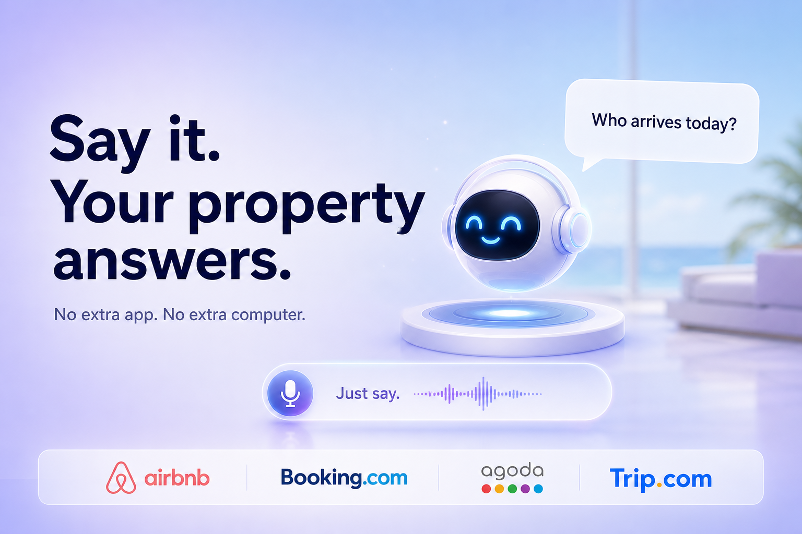
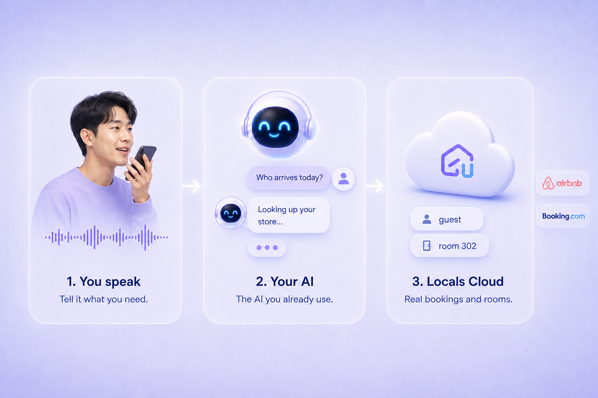
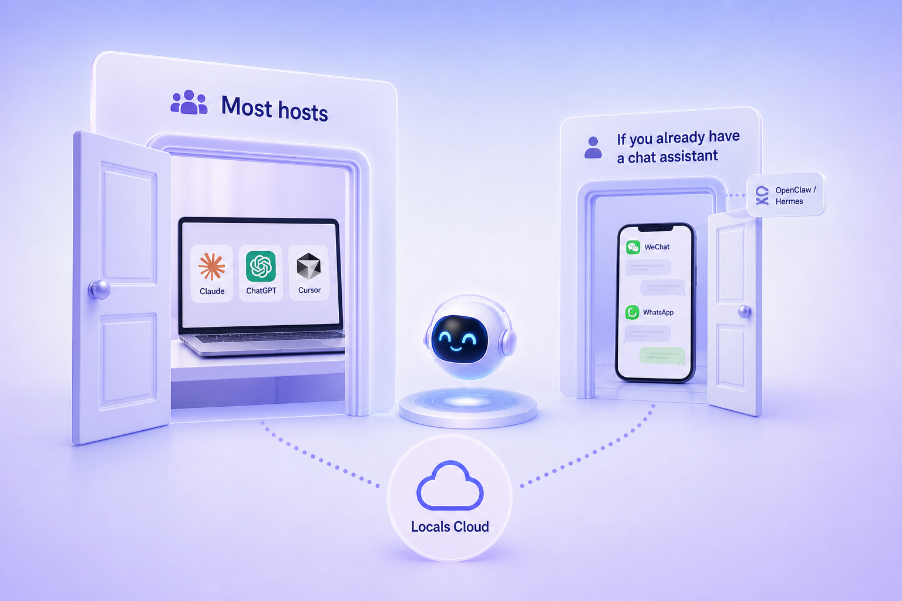
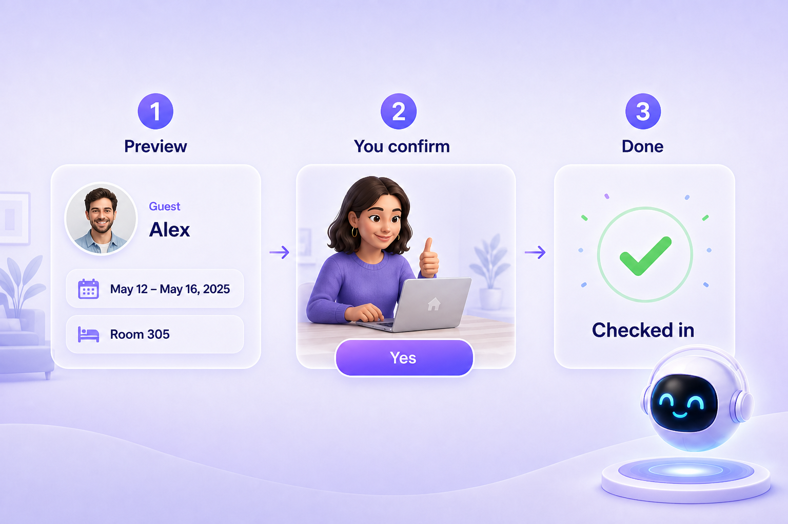

# LocalsBnb

**พูดแล้ว ที่พักตอบ**  
ไม่ต้องลงแอป LocalsBnb อีก ไม่ต้องมีคอมเครื่องพิเศษ AI ที่คุณใช้อยู่แล้ว คือเคาน์เตอร์

**Language:** [English](../../README.md) · [简体中文](README.zh-CN.md) · [繁體中文](README.zh-TW.md) · [日本語](README.ja.md) · [ภาษาไทย](README.th.md) · [Bahasa Melayu](README.ms.md)



---

## นี่คืออะไร?

บ้านคุณอยู่บน **LocalsBnb** ต่อ **Airbnb, Booking.com, Agoda, Trip.com** อยู่แล้ว สำหรับโฮสต์ที่ไม่ยอมใช้ชีวิตอยู่ในแดชบอร์ดอีกต่อไป

แบบเดิม: ปลดล็อกมือถือ เปิดสี่แอป รอปฏิทินหมุน จดชื่อ แล้วลืมว่า 302 คือใคร

แบบใหม่: เปิดแชทที่คุยอยู่แล้ว พูดเหมือนเรียกหัวหน้าเวร

> “วันนี้ใครเข้า?”  
> “ห้องวิวทะเล วันเสาร์ว่างไหม?”  
> “เช็คอิน Anna — ขอดูรายการก่อน”

**Just say.** LocalsBnb อยู่หลัง AI ของคุณ ดึงแขกจริง ห้องจริง ตัวเลขจริง คนคิดยังเป็นคุณ ส่วนที่ต้องคลิกไปมา เลิกได้แล้ว



---

## ใช้กับซอฟต์แวร์อะไรได้บ้าง?

ซอฟต์แวร์ที่ “เพิ่มเครื่องมือ” ได้ ก็ต่อ LocalsBnb ได้ **ติดตั้งครั้งเดียว** แชทในแอปนั้นจัดการที่พักได้เลย

**บนคอมพิวเตอร์ ที่คนใช้เยอะ**

| แอป | ใครจะถนัด |
|-----|-----------|
| **Claude** (Claude Desktop) | เริ่มต้นง่ายสุด พูดภาษาคน |
| **ChatGPT** | เปิด ChatGPT ทุกวันอยู่แล้ว |
| **Cursor** | ทำงานใน Cursor อยู่แล้ว |
| **Windsurf** | เอดิเตอร์ AI ที่เพิ่มเครื่องมือได้เหมือนกัน |
| **VS Code + GitHub Copilot** | โน้ตบุ๊กเป็น VS Code อยู่แล้ว |

**ในแชทที่คุยอยู่แล้ว**

โฮสต์ต่างประเทศส่วนใหญ่อยู่ที่ Claude / ChatGPT / Cursor OpenClaw กับ Hermes ไม่ใช่ทางติดตั้งหลักของต่างประเทศ — มีความหมายเมื่อคุณมีผู้ช่วยที่อยู่ในแอปแชทอยู่แล้ว

| คุณคุยที่ไหน | LocalsBnb ไปถึงยังไง |
|-------------|----------------------|
| **WeChat / WeCom / Feishu / DingTalk** | จีน: ใส่รหัสชุดเดียวกันใน OpenClaw หรือ Hermes เดินไปก็ถามได้ |
| **WhatsApp / LINE / Telegram / iMessage** | ต่างประเทศ: เฉพาะเมื่อ OpenClaw หรือ Hermes เป็นผู้ช่วยของแชทนั้นอยู่แล้ว รหัสชุดเดียวกัน ถ้าไม่มี ให้เริ่มที่ Claude / ChatGPT / Cursor |



เลือกแอปที่ **ตื่นมาแล้วนิ้วไปกดเอง** อย่าไปโหลดแอปโรงแรมอันที่ห้า

---

## ทำอะไรได้จริง?

### ทั้งวัน ถามแบบนี้ได้เลย

**7:10 ยังอยู่เตียงเมืองอื่น**  
“วันนี้ใครเข้า ใครพัก ใครออก บอกทีเดียว”  
คำตอบเดียว ชื่อ ห้อง วัน ยังไม่ดื่มกาแฟก็ทักแม่บ้านได้แล้ว

**8:00 ส่งเวรเคาน์เตอร์**  
“ก่อน 11 โมงใครออก? ยังมีห้องสกปรกไหม?”  
พนักงานใหม่ไม่ต้องเรียนระบบสองชั่วโมง เขารู้วิธีถามคนอยู่แล้ว

**10:30 แขกโทรมา**  
“ครอบครัวหลินเข้าก่อนได้ไหม? ห้องนั้นคนก่อนออกกี่โมง?”  
ตอบในสามสิบวินาที ไม่ใช่ “เดี๋ยวเปิดคอมก่อน”

**12:00 มองสุดสัปดาห์**  
“ศุกร์ถึงอาทิตย์ Airbnb ราคาเท่าไหร่? Agoda ล่ะ?”  
เทียบช่องทางในลมหายใจเดียว ไม่ต้องล็อกอินสี่ที่

**15:00 แม่บ้านในทางเดิน**  
“ตอนนี้ห้องไหนว่างและสะอาด?”  
ไม่ต้องให้รหัสเธอ คุณดูแล้วบอก

**18:00 กรุ๊ปเจ้าของทวงตัวเลข**  
“สัปดาห์นี้อัตราเข้าพัก ราคาเฉลี่ย รายได้?”  
ตัวเลขตาม**ภาษาและสกุลเงินของร้าน** ที่ตั้งใน LocalsBnb ไม่ต้องตั้งซ้ำที่นี่

**21:40 ขออยู่ต่ออีกคืน**  
“ต่อคืนให้ได้ไหม?” *(ร้านต่างประเทศ)*  
AI กางก่อน: **ใคร ห้องไหน วันไหน** คุณบอกได้ ค่อยทำ

**22:15 จัดห้องผิด**  
“คืนนี้ย้ายจาก 201 ไป 305” *(ร้านต่างประเทศ)*  
กฎเดิม ชี้รายการ คุณยืนยัน แล้วค่อยย้าย

**วันหยุด / ฝน / คอนเสิร์ตข้างบ้าน**  
“สัปดาห์นี้เต็มแค่ไหน เทียบสัปดาห์ก่อน?”  
จะขึ้นราคาวันหยุดไหม ดูสัปดาห์ตรงหน้า ไม่ใช่เดา

**วันแรกของพนักงานใหม่**  
ไม่ต้องท่องเมนู จำสามประโยค: *วันนี้ใครเข้า ห้องวันนี้ ตัวเลขสัปดาห์นี้*

### เรื่องเข้าออก — เฉพาะร้าน LocalsBnb ต่างประเทศ

ให้ AI **เช็คอิน เช็คเอาต์ ต่อคืน ย้ายห้อง** ได้

จะไม่แอบทำ ต้องโชว์แขกและวันก่อน คุณบอกว่า “ใช่รายการนี้” แล้วค่อยเดินเครื่อง



**ร้านในจีน:** คำถาม “วันนี้เป็นยังไง” ใช้ได้เหมือนกัน **เช็คอิน เช็คเอาต์ ต่อคืน ย้ายห้อง ยังไม่มีในเวอร์ชันจีน** ยกเลิกจอง แก้ราคาประกาศ ซิงก์ปฏิทิน ยังทำใน LocalsBnb

---

## เริ่มยังไง? (สามขั้น)

### 1. เอาสองรหัสจาก LocalsBnb

เข้า LocalsBnb แล้วคัดลอก:

- **APP_SECRET** — กุญแจ  
- **APP_ID** — รหัสร้าน  

ของเราคนเดียว อย่าส่งในกรุ๊ป

### 2. ใส่ใน AI ที่เลือก

เปิด **Claude, ChatGPT หรือ Cursor** เพิ่มเครื่องมือ / MCP วางอันนี้ แล้วใส่รหัสคุณ

```json
{
  "mcpServers": {
    "LocalsBnb MCP": {
      "command": "npx",
      "args": ["--yes", "localsbnb-mcp-server"],
      "env": {
        "APP_SECRET": "<your APP_SECRET>",
        "APP_ID": "<your APP_ID>"
      }
    }
  }
}
```

| คุณใช้… | มักอยู่ที่ |
|---------|------------|
| Cursor | ตั้งค่า → MCP หรือไฟล์ `mcp.json` |
| Claude Desktop | ตั้งค่า → เครื่องมือกำหนดเอง / MCP |
| ChatGPT | ตั้งค่า → แอป / นักพัฒนา (ตามแพ็กเกจ) |
| WeChat / Feishu (จีน) | ให้คนที่ติดตั้ง OpenClaw หรือ Hermes ใส่รหัสชุดเดียวกัน |
| WhatsApp / LINE / iMessage | เฉพาะเมื่อ OpenClaw หรือ Hermes พูดในแชทนั้นอยู่แล้ว — รหัสชุดเดียวกัน ไม่เช่นนั้นใช้ Claude / ChatGPT / Cursor |

ขี้เกียจหาเมนู บอก AI ไปเลย:

> ช่วยติดตั้ง localsbnb-mcp-server นี่คือ APP_SECRET และ APP_ID ของฉัน

### 3. พูดแบบโฮสต์ ไม่พูดแบบโปรแกรมเมอร์

- “วันนี้ใครเข้า?”  
- “ขอดูห้องวันนี้”  
- “ราคา Airbnb สัปดาห์นี้”  
- “สัปดาห์นี้เป็นยังไง?”  
- “เช็คอิน Maria — ขอดูรายการก่อน” *(ต่างประเทศ)*

คำตอบตาม**ภาษาร้าน**ใน LocalsBnb ไม่ต้องเลือกไทยหรืออังกฤษอีกที่นี่

---

## อยากให้ช่วย?

[localsbnb.com](https://localsbnb.com/)
